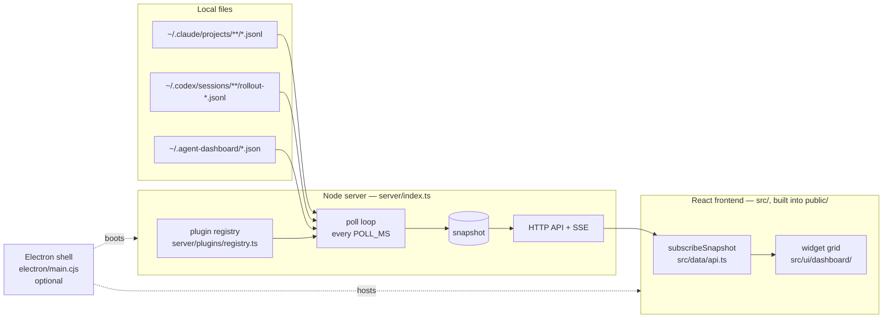

# Architecture Overview

Mimiron is a **local-first monitoring dashboard for AI coding agents**
(Claude Code, OpenAI Codex today). It reads agents' local log files, normalizes
them into a common data model, and renders status, sessions, context usage,
costs, rate limits, and required user actions — on a small always-on monitor or
in a desktop window.

Three product invariants shape everything:

1. **Never invent data.** Every field is labelled `real` / `inferred` / `manual`
   in a `sources` map; missing data is `null` and renders as `—`.
2. **Local only.** The server binds to `127.0.0.1`, reads local files read-only,
   makes no external requests. The frontend loads no CDN assets.
3. **Core is agent-agnostic.** Everything claude/codex-specific lives in plugins
   ([[plugin-system]]); the core (poll loop, HTTP API, UI shell) only knows the
   normalized model ([[normalized-agent-data]]).

## Big picture

- The **server** ([[runtime-boundaries]]) polls each registered plugin's
  `collect()` every `POLL_MS` (default 2 s), assembles a `Snapshot`, and pushes
  it to clients over Server-Sent Events. See [[data-flow]].
- The **frontend** is a Vite-built React app served statically from `public/`.
  It renders one `AgentCard` per widget instance on a drag/resize grid.
  See [[widget-system]].
- The **Electron shell** is optional and thin: it boots the same server
  in-process (from the compiled `dist-server/` output) and points a window at
  it. It additionally owns file-based theme persistence over IPC ([[theme-system]]).

## Stack

| Layer | Tech |
|---|---|
| Language | TypeScript everywhere (strict); runs uncompiled on Node ≥22.18 via type stripping |
| Server | Node `http` + SSE, **zero runtime dependencies** |
| Frontend | React 19, MUI, react-grid-layout, built by Vite into `public/` |
| Desktop | Electron 33 + electron-builder (consumes compiled `dist-server/`) |
| Types contract | `shared/types.ts` — one definition of the domain model for server and client |
| Tests | Node built-in `node:test` (`npm test`) |

## Why this architecture exists

The dashboard behaves like a **small platform**: a stable core (poll loop, API,
normalized model, widget grid, theme engine, settings store) plus extension
points for agents, widgets, themes, and overrides — so adding an agent is one
plugin file, not a core change. The catalog of extension points is in
[[extension-points]]; honest limitations in [[architectural-risks]].
