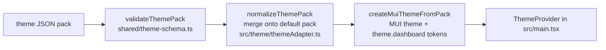

# Theme System

Themes are **JSON packs** ([[theme-json-schema]]) mapped into MUI at runtime.
Components never hardcode colors — they read `theme.palette.*` (standard MUI)
and `theme.dashboard.*` (dashboard-specific tokens).

## Pipeline

- **Validation** is the single shared module `shared/theme-schema.ts`
  (ADR-0002) — used by the renderer *and* (compiled) by Electron main. An
  invalid import is rejected with readable errors; it can't crash the app.
- **Normalization** deep-merges the pack over the default
  (`terminal-console`), so partial packs are safe and new tokens get sane
  fallbacks.
- **Adaptation**: `createMuiThemeFromPack` maps pack tokens to MUI palette /
  typography / shape / shadows / component overrides, and exposes the raw
  dashboard tokens at `theme.dashboard` (fontMono, status colors, radius,
  effects, appChrome…). If a component needs a themed value that doesn't
  exist, add a token to the pack schema — don't inline a hex.

## Two persistence backends (one interface)

Both implement the same `ThemeApi` interface (`shared/types.ts`); the app
picks whichever exists at `window.agentThemes`, else the browser one:

| | Electron | Browser |
|---|---|---|
| Implementation | `electron/main.cjs` IPC (`themes:*`) via `preload.cjs` | `createBrowserThemeApi()` in `src/main.tsx` |
| Built-ins | read from `themes/*.json` on disk | bundled at build time (`builtInThemeModules` in `themeAdapter.ts`) |
| Custom themes | `<userData>/themes/*.json` | localStorage `agent-control.customThemes` |
| Selected theme | `<userData>/theme-settings.json` | localStorage `agent-control.selectedThemeId` |

The stores do **not** sync — a theme imported in the browser doesn't exist in
the Electron app and vice versa ([[architectural-risks]]).

## Fallback behavior

Missing/deleted/invalid selected theme → `DEFAULT_THEME_ID`
(`terminal-console`). Malformed bundled or custom theme files are skipped at
load, never fatal.

## Built-in themes

`themes/`: terminal-console (default), graphite-minimal, neon-pink,
futuristic-control-room, light-productivity, amber-retro-console. All are
validated by `test/theme-schema.test.ts` — a malformed bundled theme fails CI
(well, `npm test`).

## How to safely change this

- New token → add to `ThemePack` type + all bundled packs (or make optional
  with a merge fallback) + consume via `theme.dashboard` + document in
  [[theme-json-schema]].
- New validation rule → `shared/theme-schema.ts` only; both backends and the
  tests pick it up. Remember Electron reads it **compiled** — `npm run app`
  rebuilds `dist-server/` automatically.
- Adding a built-in: [[adding-a-theme]].
