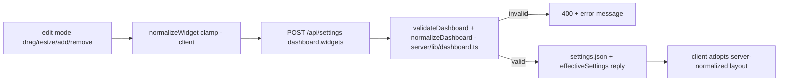

# Widget System

The dashboard is a 12-column drag/resize grid of **widget instances**. Users
compose it in edit mode; the composition persists server-side.

## Widget instance model

```ts
// shared/types.ts
interface WidgetInstance { widgetId: string; pluginId: string; x: number; y: number; w: number; h: number }
```

- `widgetId` — unique instance id, generated client-side
  (`makeWidgetId` in `src/ui/dashboard/layout.ts`: `<pluginId>-<time36>-<rand>`).
- `pluginId` — which plugin's data the widget shows. Multiple widgets of the
  same plugin are allowed.
- Geometry in grid units; **the plugin's `layout` limits govern min/max size**,
  server defaults `{ minW:2, minH:2, defaultW:6, defaultH:5, maxW:8, maxH:40 }`
  (`server/plugins/registry.ts`).

## Data flow of a layout change



Server validation rejects: non-object widgets, missing/duplicate `widgetId`,
unknown `pluginId`, non-finite geometry. Geometry is rounded and clamped to
the plugin's limits. Nothing invalid can reach `settings.json`
(tests: `test/dashboard.test.ts`).

## Rendering

- `src/ui/dashboard/` owns the grid: `layout.ts` (pure geometry —
  `normalizeWidget`, `findOpenPosition`, `buildResponsiveLayouts`; tested in
  `test/ui-layout.test.ts`), `useDashboard.ts` (state + optimistic save
  cycle), `DashboardGrid.tsx` (react-grid-layout wiring; breakpoints `lg/md`
  12 cols, `sm` 6, `xs/xxs` 1 — small screens get an auto-derived stacked
  layout).
- Each widget renders `AgentCard` (`src/ui/agent-card/`) with: the agent's live `AgentState` from the
  snapshot (or an honest `unknown` placeholder if the agent isn't in the
  snapshot yet), the plugin's metadata, and its own size (cards adapt content
  density to `w`/`h` — the `small`/`medium` variants).
- Loading/empty/error states are data-driven: no snapshot yet → placeholder
  card with status UNKNOWN; collector failure → status ERROR (from
  `errorAgentState`); no sessions → "No recent sessions".
- Widget enablement doubles as plugin enablement: **a plugin with zero widgets
  isn't polled** ([[plugin-system]]).

## Known limitation (by design, for now)

There is exactly **one widget type**: the agent card. `pluginId` selects the
data source, not a renderer. Plugin-specific renderers would need a frontend
component registry + build step — see [[architectural-risks]] and open an ADR
before building it.

## How to safely change this

- New per-widget config (e.g. a title override): extend `WidgetInstance` with
  an optional field, accept it in `validateDashboard`, thread it through
  `normalizeWidget` on the client. Old settings files must keep loading.
- New card layout behavior → `src/ui/agent-card/AgentCard.tsx`; remember
  `npm run build` afterwards ([[commands]]).
